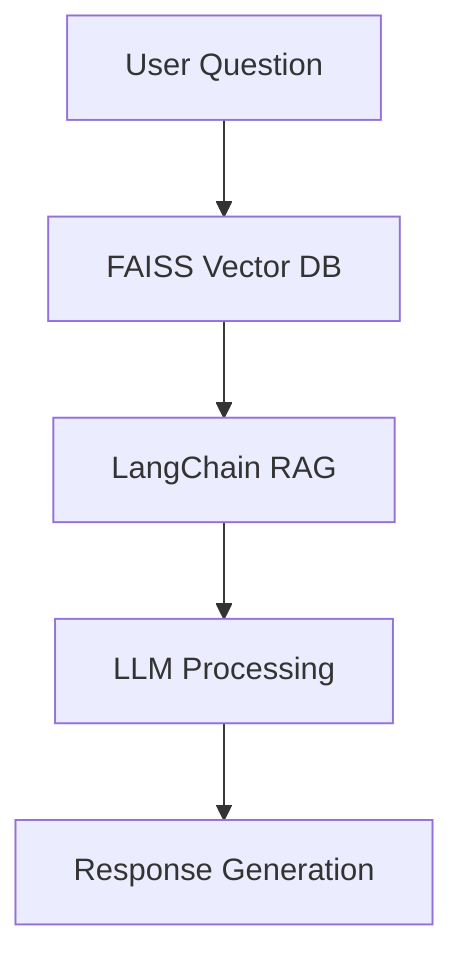

# Public Health Surveillance RAG System


A question-answering system for public health professionals using Retrieval Augmented Generation (RAG) architecture.

## Features

- Natural language queries about disease surveillance protocols
- Context-aware responses from technical guidelines
- Conversation history tracking
- FAISS vector database integration
- LangChain framework for document processing

## Installation

1. Clone repository:
```bash
git clone https://github.com/guru-dharsan-git/EpiAssist.git
cd EpiAssist
```

2. Install dependencies:
```bash
pip install -r requirements.txt
```

3. Download FAISS index files to `faiss_langchain_db/`

## Usage

Start the Streamlit application:
```bash
streamlit run strem.py
```

### Interface Guide
- **Main Panel**: 
  - Enter questions in chat interface
  - View conversation history with markdown formatting
- **Sidebar**: 
  - View system architecture details

## Data Sources
- Technical Guidelines (TG) Booklets
- WHO outbreak investigation protocols
- CDC laboratory confirmation standards
- National epidemiological manuals

## Architecture



## Development
To modify the system:
1. Update the FAISS index with new documents
2. Adjust the RAG pipeline in `model.py`
3. Customize the UI in `strem.py`

